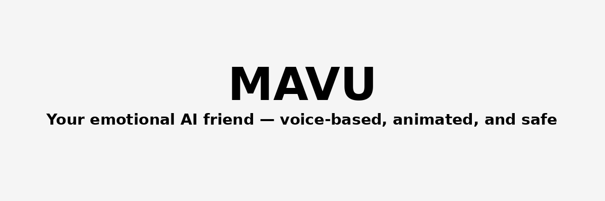

docs/logo.png
<p align="center">
  
</p>

<h1 align="center">MAVU</h1>
<p align="center"><i>Voice-based emotional game & AI companion for children</i></p>

---

> 🎮 MAVU is a magical voice-based AI companion.  
> A child talks to a gentle animal friend — who listens, remembers, and supports.  
> Built with love, large language models, and a vision for emotionally intelligent technology.

---

### 🚀 Live Demo

👉 [**Launch MAVU on ChatGPT**](https://chatgpt.com/g/g-68285b2edf208191a705a151f1b7d94d-mavu-tsifrovoi-drug-dlia-liudei-starshe-13-ti-let)

No login required. Available in **Russian** and **English**.

---

### 🧩 Key Features

- 🗣️ Voice-based interaction with GPT
- 🧠 Emotional memory and personalization
- 🐾 3D animated avatar (AI-generated + rigged)
- 🧸 Game-style interface and daily engagement loops
- 🌍 Multilingual support
- 👪 Parental dashboard & emotional alerts

---

### ⚙️ Tech Stack

| Layer             | Technology / Stack                                         |
|------------------|-------------------------------------------------------------|
| Dialogue Engine   | ChatGPT / Claude + Convai memory system                   |
| Voice Stack       | Whisper (ASR), TTS (Azure / ElevenLabs planned)           |
| Avatar/3D Layer   | Unity + Ready Player Me / DeepMotion + Auto-Rig AI        |
| UX/Game Loop      | React / WebGL / Voice UI planning                         |
| Data & Safety     | Local LLM / Analytics (WIP), Emotional flags for parents  |

---

### 📦 Project Structure

```bash
├── prototype/            # MVP prototype files
├── docs/                 # Screenshots, branding, diagrams
├── src/                  # (planned) App source code
└── README.md

